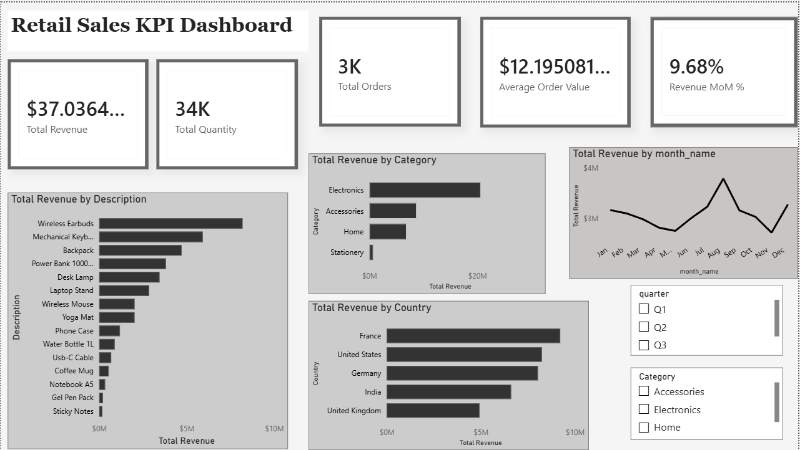
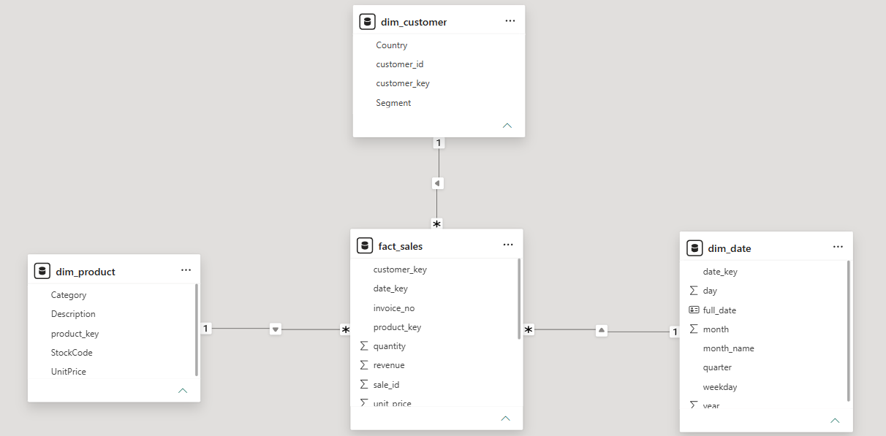

# Retail KPI Dashboard



I built this to practice the workflow an analytics team actually follows: take a
messy sales export, clean it, model it properly, and turn it into a dashboard
people can use.

## The idea
Sales data usually turns up messy and scattered, and different people end up
reporting different numbers from it. So instead of dropping the raw file straight
into charts, I cleaned it and reshaped it into a star schema — one place all the
numbers come from.

## The data
The data is synthetic. I wrote `src/generate_raw_data.py` to generate retail
transactions and deliberately make them messy — missing customer IDs, duplicate
rows, inconsistent country names ("united kingdom" vs "United Kingdom"), "N/A"
prices, and returns. I kept the columns close to the classic "Online Retail"
dataset, so the same pipeline would work on real data with small changes. Doing it
this way meant I actually had messy data to clean, instead of something already tidy.

## How it works
`src/build_star_schema.py` reads the raw file, cleans it, and splits it into one
fact table (`fact_sales`) and three dimension tables (`dim_product`,
`dim_customer`, `dim_date`). Everything is saved to a SQLite database — the single
source of truth — and also written out as CSVs for Power BI to read.

In Power BI I connected those tables into a star schema, wrote a few DAX measures
(total revenue, orders, average order value, month-over-month growth), and built
the dashboard with slicers so it's interactive.



## Running it
```bash
python src/generate_raw_data.py    # make the messy raw data
python src/build_star_schema.py    # clean it and build the star schema
```
Then open `retail_kpi_dashboard.pbix` in Power BI Desktop.

## Built with
Python (pandas), SQLite, SQL, Power BI, DAX.
